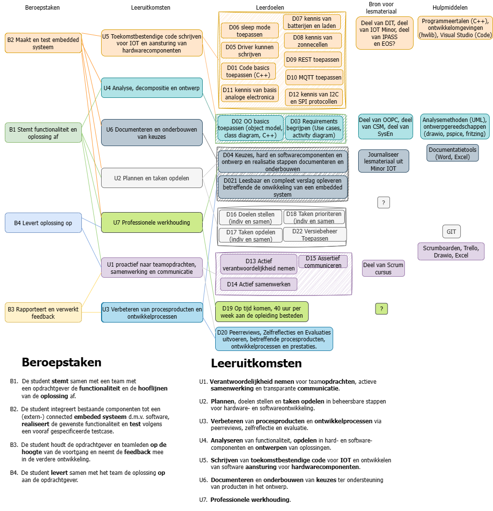

# HBO-ICT Onderwijs Architectuur

## Over dit document

Dit document geeft aan hoe bij HBO-ICT het onderwijs in grote lijnen wordt ontworpen, startend met de volgende lagen in de hierarchie:

- HBO-I competentiematrix

- Eindtermen

- Beroepstaken

- Leeruitkomsten

- Leerdoelen

### HBO-I competentiematrix

Alles wat een ICT-er globaal kan, in ons geval in een TI-er, kun je in de eerste plaats definieren door in een 3D-HBO-I competentiematrix hokjes aan te vinken. Dat komt op hetzelfde neer als in een 2D matrix hier en daar getalletjes van 1 tot 3 in te vullen.
In het toetsprogramma heeft Huib dat gedemonstreerd bij S2:

- Langs de y-as staan de **architectuurlagen**: **G**ebruikersinterface, **O**rganisatieprocessen ,**I**nfrastructuur, **S**oftware, **H**ardware Interfacing.

- Langs de x-as staan van links naar rechts de **ICT-activiteiten uit de lifecycle** van informatiesystemen: **Analyseren**, **Adviseren**, **Ontwerpen**, **Realiseren**, **Beheren**

- De ingevulde getalletjes zeggen iets over het **niveau** waarop. Een definitie van die niveaus heb ik niet gevonden. Onderstaand zijn wel voorbeelden van de niveaus gegeven m.b.t. de architectuurlaag Hardware Interfacing:
  
  - **Niveau 1**: Bijvoorbeeld software schrijven voor een eenvoudig gegeven computersysteem, voorzien van sensoren en actuatoren.
  - **Niveau 2**: Bijvoorbeeld Inrichten van eenvoudig computersysteem en via software de koppelingen met hardware componenten testen. Of het implementeren en testen van een protocol.  
  - **Niveau 3**: Bijvoorbeeld Realiseren van een compleet computersysteem inclusief netwerk, hardware en systeemsoftware. Of opstellen en uitvoeren van een acceptatieprocedure, bijv in een virtuele omgeving, inclusief aspecten als timing, resourcegebruik en performance.
  - **Niveau 4**: Bijvoorbeeld Realiseren van een compleet computersysteem waarbij gebruik gemaakt wordt van hardware synthese (vhdl) of artificial intelligence.

S2 is het eerste semester. Vandaar dat het niet verwonderlijk is dat we daar alleen enkele competenties op niveau 1 tegenkomen. In S3 en S4 dekken we in ieder geval niveau 2 af. Aan het eind van de studie delen van niveau 3.

### Eindtermen TI

Op de eerste sheet van de powerpoint zie je de zg. eindtermen voor TI. Een eindterm beschrijft in algemene bewoordingen wat er van een technisch informaticus na afstuderen minimaal verwacht mag worden. De eindtermen zijn verdeeld in 5 technish inhoudelijke eindtermen en 4 over professional skills.

Verderop zie je sheets waarbij de eindtermen verder van detail voorzien zijn.

### Beroepstaken

We verdelen ons curriculum over Semesters S2, S3 en S4. Voor elk van de semesters kunnen we ons afvragen wat we willen dat de student in het bedrijfsleven concreet zou moeten kunnen doen na het volgen van het betreffende semester. 
Dus niet wat hij begrijpt en weet, maar meer wat hij (daarmee) kan doen. Het zijn een handvol top-level veel voorkomende scenarios.

Meer daarover bij de bespreking verderop van de eerdere Workshop op weg naar HBO ICT.

### Leeruitkomsten

Er is een soort hierarchy van generiek naar gedetailleerder. Voor een semester staan boven aan de keten de beroepstaken. Die worden vervolgens geherformuleerd en zodanig opgesplitst, dat duidelijk wordt waarop de student bij programmatisch toetsen getoetst moet gaan worden.

### Leerdoelen

Elke leeruitkomst is gekoppeld aan een of meerdere leerdoelen. Leerdoelen geven de gewenste resultaten weer, gekoppeld aan specifieke onderdelen en/of lesstof. Dus weer een trapje gedetailleerder. Bij het programmatisch toetsen kan het zijn dat een student niet goed scoort op een bepaald leerdoel, maar door voldoende kwaliteit portfolio op andere leerdoelen die gekoppeld zijn aan de betreffende leeruitkomst aan te dragen kan hij nog steeds slagen.

### Voorbeeld van een prototype Beroepstaak Leeruitkomst Leerdoel Hierarchy voor S2

Onderstaande geeft een indruk van hoe een en ander samenhangt. Van generiek naar gedetailleerder. Het voordeel om zo generiek mogelijk te beginnen geeft meer mogelijkheden om flexibel dingen aan te passen zonder ACO (of was het iets anders? Arno Help :-) ) te hoeven updaten. 

NB: bovenstaande protoype was maar een voorzet/suggestie (net als dit document). Uiteindelijk is er wat anders uitgekomen (zie o.a. de S2 documentatie).

# 
